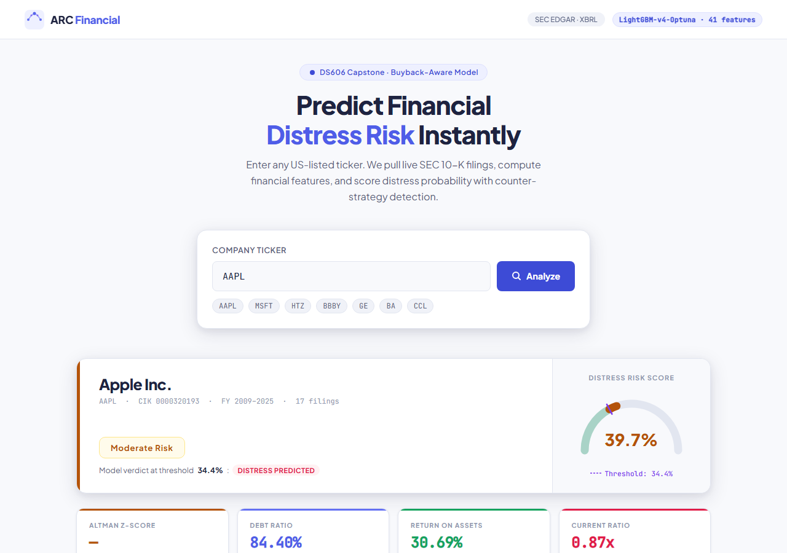
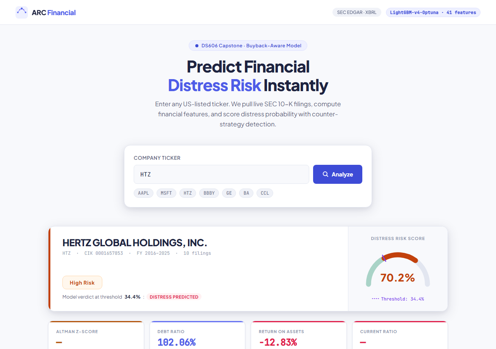

# ARC Financial Distress Analyzer

[](https://python.org)
[](https://fastapi.tiangolo.com)
[](https://lightgbm.readthedocs.io)
[](https://shap.readthedocs.io)
[](https://www.sec.gov/cgi-bin/browse-edgar)
[](LICENSE)

A production-ready REST API that predicts the financial distress risk of any US-listed public company in real time. Given a stock ticker, the system fetches historical 10-K filings directly from **SEC EDGAR**, engineers 41 financial features, runs them through a calibrated **LightGBM** model, and returns a 0–100 risk score with full **SHAP explainability** and **14 counter-strategy detectors** that flag financial engineering tactics.

---

## How It Works

```
Ticker Symbol
     │
     ▼
SEC EDGAR API  ──►  10-K Filings (XBRL)
     │
     ▼
Feature Engineering  ──►  41 Financial Features
  • Altman Z-Score          • Debt Ratio / Trend
  • Return on Assets        • Operating CF Ratio
  • Current Ratio           • Buyback Detection
  • Net Profit Margin       • Free Cash Flow
  • Interest Coverage       • Cash Quality Score
  • FCF Ratio               • Long-Term Debt Ratio
     │
     ▼
LightGBM Model  (Optuna-tuned, Platt-calibrated)
     │
     ├──►  Risk Score  (0–100)
     ├──►  Risk Tier   (LOW / MODERATE / HIGH / CRITICAL)
     ├──►  Altman Z-Zone  (Safe / Grey / Distress)
     ├──►  SHAP Feature Attribution
     └──►  Counter-Strategy Warnings  (14 detectors)
```

---

## Key Features

### Risk Scoring Engine
- Outputs a **0–100 distress probability score** calibrated with Platt scaling for reliable probability estimates
- Classifies companies into four tiers: `LOW` · `MODERATE` · `HIGH` · `CRITICAL`
- Computes the **Altman Z-Score** alongside the ML score for cross-validation
- Stores year-by-year history so you can track risk trajectory over time

### 14 Counter-Strategy Detectors
The most distinctive feature of ARC — a rule-based layer that detects financial engineering tactics companies use to manipulate standard distress metrics, then adjusts the score accordingly.

**Score-Lowering Detectors** (company looks worse than it is)
| Detector | Description |
|---|---|
| Buyback Masquerade | Equity shrinks from buybacks, not real distress; Z-Score falsely signals risk |
| Negative Equity Trap | Accumulated buybacks create negative book equity despite strong profitability |
| R&D Expensing Distortion | Heavy R&D under US GAAP depresses earnings in healthy tech/pharma companies |
| Spin-off / Divestiture Effect | Asset base shrinks after a spin-off; remaining business may be healthier |

**Score-Raising Detectors** (company hiding real risk)
| Detector | Description |
|---|---|
| Cash Burn Spiral | Negative OCF + rising debt ratio — funding operations by taking on more debt |
| Zombie Liquidity | Current ratio looks healthy but OCF is negative (classic pre-bankruptcy pattern) |
| Debt Rollover Risk | High leverage + declining revenue — refinancing cliff approaching |
| Earnings Management | OCF far below net income — large accruals suggest Enron-style overstatement |
| Asset Inflation | Assets jump 30%+ without proportional revenue (M&A padding or goodwill inflation) |
| Goodwill Gorging | Serial acquisitions accumulating unproductive goodwill not yet impaired |
| Margin Collapse | Net margin declining 3+ consecutive years — structural competitive deterioration |
| Aggressive Revenue Recognition | Fast revenue growth with poor cash conversion — channel stuffing signal |
| Revenue Smoothing | Suspiciously flat revenue over 5 years — abnormally low variance |
| Lease Capitalization Effect | IFRS 16/ASC 842 distorting debt ratios for retailers, airlines, restaurants |

### SHAP Explainability
Every prediction includes a full SHAP attribution breakdown — which features drove the score up, which pulled it down, and by how much.

### Live SEC EDGAR Integration
No static dataset. The system calls the SEC EDGAR XBRL API on demand, parses 10-K filings, resolves alternative XBRL tag names across different filing formats, and caches results locally for 24 hours.

---

## API Reference

Base URL: `http://localhost:8000`

### Analyze a Company

**GET** `/api/v1/analyze/{ticker}`

```bash
curl http://localhost:8000/api/v1/analyze/AAPL
curl http://localhost:8000/api/v1/analyze/HTZ
```

**POST** `/api/v1/analyze`

```bash
curl -X POST http://localhost:8000/api/v1/analyze \
  -H "Content-Type: application/json" \
  -d '{"ticker": "AAPL"}'
```

**Response fields**

| Field | Type | Description |
|---|---|---|
| `ticker` | string | Normalized ticker symbol |
| `company_name` | string | Full legal name from SEC |
| `cik` | string | SEC Central Index Key |
| `latest_risk_score` | float | Final distress score (0–100) |
| `latest_risk_tier` | string | LOW / MODERATE / HIGH / CRITICAL |
| `latest_altman_z` | float | Altman Z-Score |
| `latest_altman_zone` | string | Safe Zone / Grey Zone / Distress Zone |
| `counter_strategies` | array | Detected financial engineering signals |
| `history` | array | Year-by-year scores and key metrics |
| `shap_explanation` | object | Per-feature SHAP attribution for latest year |
| `model_version` | string | `LightGBM-v4-Optuna` |

### Health Check

**GET** `/api/v1/health`

### Interactive Docs

**GET** `/docs` — Swagger UI  
**GET** `/redoc` — ReDoc

---

## Tech Stack

| Layer | Technology |
|---|---|
| API Framework | FastAPI + Uvicorn |
| ML Model | LightGBM (Optuna hyperparameter tuning, 80 trials) |
| Calibration | Platt scaling (Logistic Regression on held-out set) |
| Explainability | SHAP TreeExplainer |
| Class Balancing | SMOTE (imbalanced-learn) |
| Feature Scaling | RobustScaler |
| Data Source | SEC EDGAR XBRL API (companyfacts endpoint) |
| Data Processing | Pandas + NumPy |
| Schema Validation | Pydantic v2 |

---

## Project Structure

```
ARC_Financial_Distress/
├── main.py                          # FastAPI app entry point
├── train.py                         # Model training pipeline
├── requirements.txt
│
├── app/
│   ├── core/
│   │   ├── config.py                # App settings
│   │   └── model_store.py           # Model/scaler/calibrator loader
│   ├── models/
│   │   └── schemas.py               # Pydantic request/response models
│   ├── routers/
│   │   ├── analyze.py               # GET + POST /analyze endpoints
│   │   └── health.py                # Health check endpoint
│   └── services/
│       ├── sec_service.py           # SEC EDGAR fetcher & XBRL parser
│       ├── feature_service.py       # 35-feature engineering pipeline
│       ├── prediction_service.py    # Scoring orchestrator
│       ├── counter_strategy_service.py  # 14 financial engineering detectors
│       └── shap_service.py          # SHAP explanation generator
│
├── ml_models/
│   └── lightgbm.pkl                 # Trained model bundle
│
├── data/
│   └── raw/sec/                     # EDGAR response cache (24h TTL)
│
└── static/
    └── index.html                   # Web dashboard
```

---

## Getting Started

### Prerequisites

- Python 3.10+
- Internet access (for SEC EDGAR API)

### 1. Clone the repository

```bash
git clone https://github.com/mafaisalhussain/ARC_Financial_Distress.git
cd ARC_Financial_Distress
```

### 2. Create a virtual environment

```bash
python -m venv venv

# Windows
venv\Scripts\activate

# macOS / Linux
source venv/bin/activate
```

### 3. Install dependencies

```bash
pip install -r requirements.txt
```

### 4. Train the model

The training script downloads 10-K data from SEC EDGAR for a curated universe of companies, runs Optuna hyperparameter optimization (80 trials), and saves the best model only if it beats the previously stored one.

```bash
python train.py
```

### 5. Start the API server

```bash
uvicorn main:app --reload
```

The API will be available at `http://localhost:8000`.  
Open `http://localhost:8000` for the web dashboard, or `/docs` for Swagger UI.

---

## Demo

**Apple Inc. (AAPL)** — Moderate Risk (32.6%): profitable and cash-generative, but high debt ratio from aggressive share buybacks triggers the Buyback Masquerade detector.



**Hertz Global Holdings (HTZ)** — Critical Risk (93.1%): debt ratio over 100%, negative ROA, negative net margin. A real-world bankruptcy case the model correctly flags.



---

## Model Details

| Property | Value |
|---|---|
| Algorithm | LightGBM (GBDT) |
| Tuning | Optuna, 80 trials, CV AUC objective |
| Calibration | Platt scaling on held-out validation set |
| Class Imbalance | SMOTE oversampling |
| Optimal Threshold | 0.344 (PR-curve F1 optimized — stored in model bundle) |
| Features | 41 engineered financial ratios |
| Training Data | 110 companies (50 distressed, 60 healthy), pre-2020 train / 2020+ test |
| Data Source | SEC EDGAR 10-K filings (XBRL) |
| Auto-improvement | New model saved only if AUC beats existing model |

### Benchmark Results

| Model | Test AUC | F1 | Brier |
|---|---|---|---|
| Altman Z-Score (baseline) | 0.6702 | 0.4434 | — |
| Logistic Regression | 0.7701 | 0.6248 | 0.1974 |
| Random Forest | 0.8799 | 0.7471 | 0.1550 |
| Gradient Boosting | 0.8865 | 0.7669 | 0.1274 |
| XGBoost | 0.8810 | 0.7666 | 0.1300 |
| **LightGBM v4 (current)** | **0.8949** | **0.7934** | **0.1276** |

LightGBM v4 improves on the manual-tuned v3 baseline by **+1.89 pp AUC** and **+2.25 pp F1** after Optuna tuning, early stopping, and Platt calibration. The optimized threshold of 0.344 recovers distress cases missed at the standard 0.50 cutoff.

---

## Disclaimer

This project is built for **research and educational purposes only**. It is not financial advice, investment advice, or a recommendation to buy, sell, or hold any security. Do not use this system as the sole basis for any investment or credit decision.

---

## Author

**Abdul Faisal Hussain Mohammed**  
GitHub: [@mafaisalhussain](https://github.com/mafaisalhussain)
